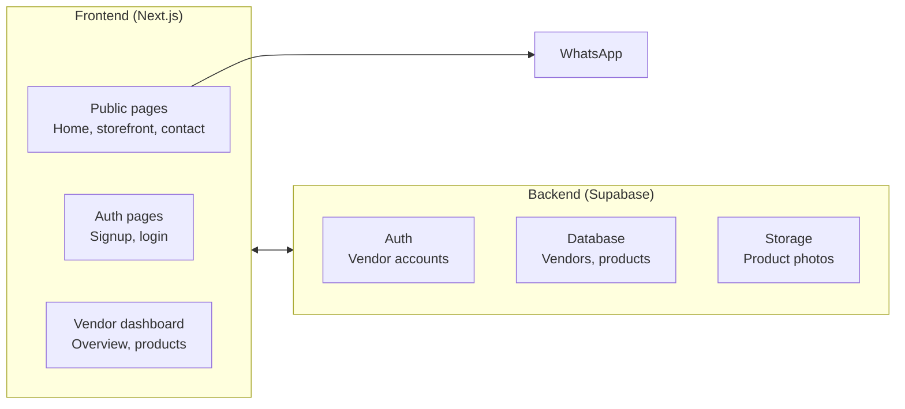
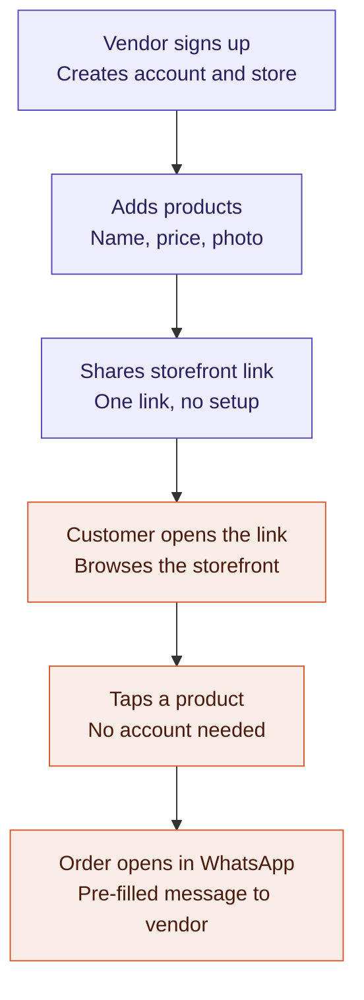

# ShopLink — Roadmap

A WhatsApp-native storefront platform. Vendors get a shareable link; customers
browse and order with a single tap into WhatsApp — no accounts, no app installs,
no forms.

## Architecture

Notes:
- The Frontend ↔ Backend connection is the Supabase JS client, used from both
  server components (reads) and the browser (writes/uploads).
- WhatsApp only ever connects to the **frontend**. A customer's order message
  goes straight to the vendor's own WhatsApp — it never touches our database.

## User flow

Steps A–C (vendor side, purple) are fully working today. Steps D–F (customer
side, coral) depend on the public storefront page, which is the next thing to
build — it's the missing link connecting the two halves of this flow.

## Roadmap

| Phase | Status | Scope |
|---|---|---|
| **Phase 1 — Core product** | 🟢 Live | Vendor signup/login, dashboard overview, product add/edit/delete with photo upload, homepage, navbar, contact page |
| **Phase 2 — Polish for pilot** | 🟡 Next up | Public `/store/[slug]` storefront page, "Order via WhatsApp" button, storefront preview before going live, mobile responsiveness pass |
| **Phase 3 — Deferred** | ⚪ Not started | Payment links (Paystack/Flutterwave), custom domains, analytics/click tracking, multi-item cart |

### Current build status (detail)

- [x] Vendor signup / login (Supabase Auth)
- [x] Dashboard overview (storefront link, product count, view count)
- [x] Product list, add, edit, delete
- [x] Photo upload to Supabase Storage
- [x] Homepage with animated phone mockup
- [x] Navbar + Contact page
- [ ] Public storefront page (`/store/[slug]`) — **next**
- [ ] "Order via WhatsApp" button wired to real product data
- [ ] Storefront preview before publishing
- [ ] Mobile responsiveness pass
- [ ] Payment links
- [ ] Custom domains
- [ ] Analytics dashboard
- [ ] Multi-item cart

## Tech stack

- **Frontend**: Next.js (App Router), Tailwind CSS, Framer Motion
- **Backend**: Supabase (Auth, Postgres, Storage)
- **Hosting (planned)**: not yet decided — Vercel is the natural fit for Next.js

## Key decisions made so far

- **Path-based storefronts** (`/store/vendorname`), not subdomains — simpler
  DNS/SSL, works identically well from a shared WhatsApp link. Custom domains
  are the paid-tier differentiator instead.
- **No customer registration** — WhatsApp already knows the customer's number;
  asking them to type it into a form would be pure friction for a pilot.
- **Free-tier product cap (20)** enforced at the database layer via a Postgres
  trigger, not just the UI, so it can't be bypassed via direct API calls.